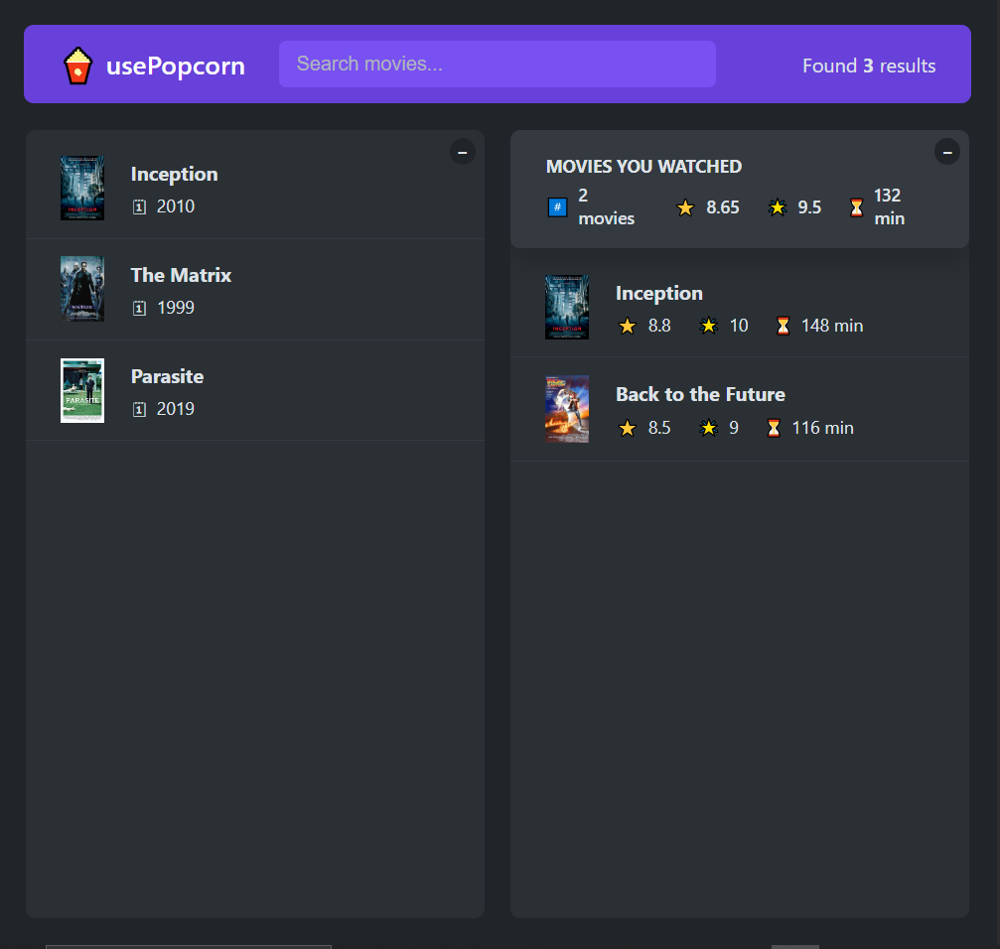

# UsePopcorn - Your Personal Movie Assistant

UsePopcorn is a modern React application that helps you discover movies and keep track of your watching history. With a clean, responsive interface, it allows you to search for movies, view details, and maintain a personal watchlist with ratings and runtime statistics.

## Demo


<p align="center">
  
</p>


##  Getting Started

### Prerequisites

- Node.js (v14.0.0 or later)
- npm or yarn

### Installation

1. Clone the repository:
   ```bash
   git clone https://github.com/ceferreira/usePopcorn-react.git
   cd usePopcorn-react
   ```

2. Install dependencies:
   ```bash
   npm install
   # or
   yarn install
   ```

3. Start the development server:
   ```bash
   npm start
   # or
   yarn start
   ```

4. Open [http://localhost:3000](http://localhost:3000) in your browser to see the application.


##  What I Learned

Through this project, I gained practical experience in:

- Splitting a user interface into reusable components
- Understanding different types of components and their use cases
- Implementing component reusability patterns
- Building a complete React application from scratch
- Creating responsive designs that work across devices


## License

This project is licensed under the MIT License - see the LICENSE file for details.

